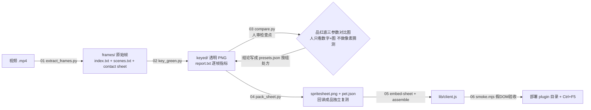

# dsh-pet-kit —— 桌宠制作流水线（提纯版）

把一套**已经跑通的**"AI 绿幕视频 → 可安装 DSH 桌宠插件"流水线，提纯成干净、自包含、可直接上传 Gitee 的仓库。
克隆即用：`examples/` 自带 12 帧真实抽帧素材，**零外部素材**就能跑通 抠图 → 人审对比 → 归一化打包 → 内嵌组装 → 冒烟验收 全链路。

> **贯穿全文的设计原则：制作者可能无法查看图像 ⇒ 每一步都必须输出可核对的数字指标，
> 同时生成供人审的对比图；人只在检查点做判断，不做像素级猜测。**
> 所有工具都遵守：`--help` 可用、`--dry` 只测量不落盘、逐帧打印指标、失败非 0 退出并打印原因。

## 这套方法解决什么问题

AI 生成的绿幕角色视频（或网图）离"能挂在网页右下角的桌宠"之间隔着一整条工艺链：
抽帧、逐张自适应抠图（同一批素材有多种绿、有阴影、有封闭残底、有烧录水印）、
归一化打包（角色不能忽大忽小）、meta（fps/循环/锚点/显示尺寸）、引擎（预切缓存/每帧现算速度/右键菜单）、
构建验收（沙箱里跑不了 headless 浏览器 ⇒ 假 DOM 冒烟替代）。
每一步的判据、踩过的坑和**实测数字**都写在 `docs/01~09`，工具在 `tools/`，可安装插件在 `plugin/`。

## 6 阶段流程



| 阶段 | 工具 | 产出 | 人审检查点 |
|---|---|---|---|
| 01 抽帧 | `tools/extract_frames.py` | 帧 + index.txt（每帧边框背景色）+ scenes.txt（按背景色分段）+ contact sheet | 看 contact sheet 分组 |
| 02 抠图 | `tools/key_green.py` | 透明 PNG（保留原画布）+ 棋盘格 contact sheet + report.txt | 看 report 数字 + 棋盘格图 |
| 03 对比 | `tools/compare.py` | 品红底三参数对比图（A严格/B腐蚀/C贴身 + 放大行） | 决定各组处方 → presets.json |
| 04 打包 | `tools/pack_sheet.py` | spritesheet.png + pet.json + 回读复测指标 | 脚底跨度=0 / 触边=0 / 空格=0 |
| 05 构建 | `plugin/tools/embed-sheet.mjs` + `assemble.mjs` | src/sheet.js（base64 内嵌）→ lib/client.js | 体积 vs 硬限 |
| 06 验收 | `tools/smoke.mjs` + `plugin/tools/verify.mjs` | 假 DOM 冒烟 N PASS/0 FAIL；（在线 GUI 时用 verify） | PASS/FAIL 数 |

## 快速开始（零外部素材，Windows + Python3.9 + Node22）

> cp936 控制台注意：Python 统一用 `cmd /c "chcp 65001 >nul && set PYTHONIOENCODING=utf-8 && python ... 2>&1"` 方式运行（下文简写为 `python ...`）。

```powershell
cd dsh-pet-kit

# 0) 抽帧（正式制作的第一步；需自备视频，仓库不含任何视频——零外部素材链路从第 1 步开始）
#    已验证（合成测试视频 320×240/24fps/60 帧）：--every 2 → 30 帧；index.txt 逐帧边框背景色；
#    scenes.txt 按背景色差 >24 切段（2 段全中）；--detect-loops 循环/非循环两判定路径；坏输入 exit 2
python tools\extract_frames.py --input <你的视频.mp4> --out .build\frames --every 2 --detect-loops

# 1) 抠图：自带 12 帧示例 → examples/keyed
#    已验证：12 张 0 异常；三种绿 rgb(120,184,88)/(160,200,88)/(120,184,80) 全部逐张自适应；
#    补洞合计 469px；report.txt 逐帧给出 背景色/容差/覆盖率/主体px/连通域/边缘绿占比
python tools\key_green.py --src examples\frames --out examples\keyed --preset examples\presets.json --group-name demo

# 2) 人审对比图：品红底三参数 + 头部放大
#    已验证：3/3 张；示例数字 f0340 的 rim_green A=56.0% → B(erode 1)=1.7%（绿边被腐蚀吃掉）
python tools\compare.py --src examples\frames --out examples\compare --samples f0097.png,f0276.png,f0340.png

# 3) 归一化打包 → 示例图集 + meta（fit-to-box，组内共用一个缩放，回读独立复测）
#    已验证：PACK OK 5/5 格；隔离 2 帧异规格（f0276 1047×639、f0300 524×317 > 400px 上限）；
#    脚底跨度 0px（alpha>8 与 >128 双口径）、触边 0、空格残留 0、gate 全过；sheet 480×112 PNG 87.5KB
#    ★ 示例图集只为跑通链路：8 个状态里 6 个（walk/react/working/sleep/dead/supervise）是
#      --fill-from-idle 用 idle 帧代填的占位动画（wait 用 idle 隔帧），不是真实动作素材；
#      换成你自己的 8 组素材后这些状态才有意义（meta.source.note 同样注明）
python tools\pack_sheet.py --src examples\keyed --out examples --map demo=idle --frames f0002.png,f0140.png,f0276.png,f0300.png,f0319.png,f0340.png,f0361.png --max-content 400 --fill-from-idle walk,react,working,sleep,dead,supervise --cell 96x112 --box 84x88 --baseline 100 --display 192x224 --cols 5

# 4) 内嵌 + 组装：PNG → base64 → src/sheet.js → lib/client.js（含 new Function 语法自检）
#    已验证：PNG 85.5KB → data URL 114.0KB → sheet.js 116.7KB；client.js 245,238B（5 源文件）；
#    embed-sheet 校验 8 状态帧坐标全部在界内；base64 0.11MB 远低于 4.0MB 硬限
mkdir .build\stage -Force | Out-Null   # embed-sheet 要求输入目录内文件名为 spritesheet.png + pet.json
Copy-Item examples\demo-sheet.png .build\stage\spritesheet.png
Copy-Item examples\demo-pet.json  .build\stage\pet.json
node plugin\tools\embed-sheet.mjs .build\stage
node plugin\tools\assemble.mjs

# 5) 假 DOM 冒烟验收（沙箱里 headless 浏览器跑不了，这是替代门槛，见 docs/06）
#    已验证：kit 引擎 + demo meta → 142 PASS / 0 FAIL；同套工具对生产 src+meta → 144/0；
#    负测试（frames 塞 [99,99] 越界）→ 143/1、FAIL 精确命中 META-04、exit 1（证明它真的能失败）
node tools\smoke.mjs --src plugin\src --meta plugin\assets\pet.json

# 一键跑 1~5（任何一步非 0 立即停并打印步骤名+退出码）：
powershell -ExecutionPolicy Bypass -File tools\build.ps1 -Demo
```

以上 0~5 全部实测通过（数字见各行注释）。**干净克隆可构建性已实测**：`git init + add -A` 后按
`git ls-files` 清单（66 文件，不含 sheet.js/client.js 等任何生成物）复制到全新临时目录，在那里跑
`build.ps1 -Demo` → 6/6 步全绿、smoke 142 PASS / 0 FAIL、exit 0，全程约 8 秒 ⇒ 克隆即可构建，
`plugin/src/sheet.js` 与 `plugin/lib/client.js` 确实能在无任何本地产物的新克隆里现场重建。

## 目录说明

```
dsh-pet-kit/
├─ README.md / LICENSE(MIT, 署名占位请自行替换) / .gitignore
├─ docs/            方法论 01~09：每条规则都带实测数字与 file:line 证据
├─ tools/           extract_frames.py / key_green.py / compare.py / pack_sheet.py / smoke.mjs / build.ps1
├─ plugin/          可直接安装的 DSH 客户端插件（提纯自 dsh-pet-bg）
│  ├─ package.json  dsh.client 配置 + exports["./client"]
│  ├─ src/          core/pet/bg/boot.js（sheet.js 为生成物，不入库，由 embed-sheet 重建）
│  ├─ lib/index.js  宿主侧入口（手写，入库；client.js 为组装产物不入库）
│  ├─ tools/        embed-sheet / assemble / copy-hd（第二阶段外挂高清图集）/ verify
│  ├─ assets/       示例小图集 + pet.json
│  └─ install.ps1   安装/卸载（-Remove 精确回滚；junction + profile 登记 + 补丁管理块，幂等）
└─ examples/        自带素材（零外部依赖跑通全链路）
   ├─ frames/       12 帧跨场景代表帧（10 帧 640×360 + f0001/f0276 原始 1280×720）
   │                + index.txt（节选 12 行，每帧边框背景色）+ scenes.txt（3 段场景）+ 2 张 contact sheet
   ├─ keyed/        key_green.py 实跑产物：透明 PNG + contact-demo.png + report.txt（自证链路）
   ├─ compare/      品红底三参数对比图 + 水印修复前后对比（cmp2）
   ├─ presets.json  8 组实战处方（keep-near/shadow/kill-static 及理由与实测数字）
   └─ demo-sheet.png / demo-pet.json / pack-report.txt   示例图集、meta 与打包复测留档
```

## 这套方法与 DSH 的耦合面

**通用（可直接移植到任何宿主/引擎）**：01 抽帧、02 抠图判据（背景众数/容差选档/边框泛洪/补洞/阴影键控/keep-near/kill-static）、
03 人审对比方法、04 fit-to-box 归一化与"图集+meta"格式思想、06 假 DOM 冒烟思路。
**DSH 专属**：`plugin/`（cordis 插件形态、package.json 的 dsh.client 配置）、embed-sheet 的 base64 内嵌与硬限、
`/plugins` 路由只服务预组合 bundle 的行为（⇒ 外挂大图集需自注册 HTTP 路由，见 docs/07）、
profile node_modules 安装方式与 install.ps1、宿主侧 `lib/index.js` 只在启动时读一次（改它必须重启服务）。

## 素材来源与版权

本次实战素材来自 **AI 生成视频抽帧（绿幕）**；部分网络图带抖音水印**不可用**（睡觉休息组教训，见 docs/09 已知缺口）。
本仓库只含 12 帧极小示例与其抠图产物（frames 5.8MB + keyed 4.4MB + compare 2.1MB，仓库总计实测 12.91MB）；**正式制作请自备素材**。
示例帧仅用于演示工艺链路，AI 生成内容的版权状态请按你所在司法辖区与生成服务条款自行判断。

## 体积红线（为什么仓库里没有大图集）

embed-sheet 的硬限卡的是 **base64 体积**（≈PNG×1.34），不是 PNG 体积；实测数字与三条路线
（内嵌 data-URL / 外挂 HTTP 路由 / IndexedDB 导入）的取舍表见 `docs/07-体积与架构权衡.md`。
本仓库示例图集刻意做到极小，让克隆→构建→冒烟在几秒内完成。

